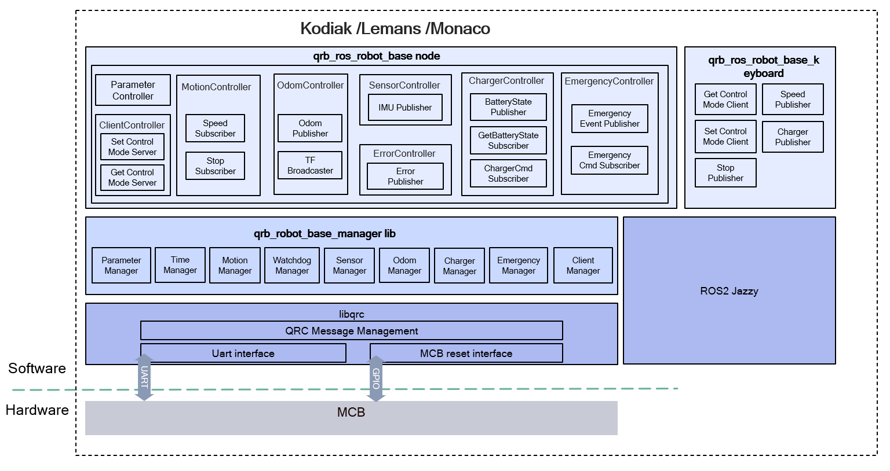

<div align="center">
  <h1>qrb_ros_robot_base</h1>
  <p align="center">
   
  </p>
  <p>ROS2 package for controlling AMR robot base</p>
  <a href="https://ubuntu.com/download/qualcomm-iot" target="_blank"></a>
  <a href="https://docs.ros.org/en/jazzy/" target="_blank"></a>
</div>

---

## 👋 Overview

**qrb_ros_robot_base** is a ROS2 package for controlling Qualcomm-specific AMR robot base it provide ROS interfaces to control AMR robot base.

It will init robot base, sync time with MCB, provide ROS interfaces for control robot base, publish robot base state with ROS topics and provide test tools for robot base control. All the data between MCB and RBx side through [QRC protocol](https://github.com/qualcomm-qrb-ros/libqrc).


<div align="center">
  
</div>

<br>

**qrb_ros_robot_base** is a ROS2 package based on `qrb_robot_base_manager`
**qrb_robot_base_manager** is C/C++ library to control robot base. it communicates with MCB using `libqrc`
**qrb_ros_robot_base_keyboard** is a ROS2 package of keyboard command line tools to control Robot base with ROS 2 messages.
**qrb_ros_robot_base_urdf** is robot base URDF model description and Rviz launch scripts.        

---

## 🔎 Table of Contents
  * [APIs](#-apis)
    * [`qrb_ros_robot_base` APIs](#-qrb_ros_robot_base-apis)
    * [`qrb_robot_base_manager` APIs](#-qrb_robot_base_manager-apis)
  * [Supported Targets](#-supported-targets)
  * [Installation](#-installation)
  * [Usage](#-usage)
  * [Contributing](#-contributing)
  * [License](#-license)

---

## ⚓ APIs

### 🔹 `qrb_ros_robot_base` APIs

#### ROS node parameters

<table>
  <tr>
    <th>Parameter</th>
    <th>Type</th>
    <th>Default Value</th>
    <th>Description</th>
  </tr>
  <tr>
    <td>ultra_enable</td>
    <td>bool</td>
    <td>true</td>
    <td>enable or disable ultrasound sensor on AMR</td>
  </tr>
  <tr>
    <td>rc_enable</td>
    <td>bool</td>
    <td>true</td>
    <td>enable or disable remote controller(JoyStick) on AMR</td>
  </tr>
  <tr>
    <td>motion_tf_enable</td>
    <td>bool</td>
    <td>false</td>
    <td>enable or disable publish tf of AMR</td>
  </tr>
    <tr>
    <td>max_speed</td>
    <td>float</td>
    <td>1.0</td>
    <td>max line speed of AMR</td>
  </tr>
    <tr>
    <td>max_angle_speed</td>
    <td>float</td>
    <td>1.5</td>
    <td>max angle speed of AMR</td>
  </tr>
</table>

#### ROS topics

<table>
  <tr>
    <th>Topic Name</th>
    <th>Message Type</th>
    <th>Description</th>
  </tr>
  <tr>
    <td>/cmd_vel</td>
    <td>geometry_msgs::msg::Twist</td>
    <td>Subscribe topic for velocity control</td>
  </tr>
  <tr>
    <td>/odom</td>
    <td>nav_msgs::msg::Odometry</td>
    <td>Publish topic for odom</td>
  </tr>
  <tr>
    <td>/tf</td>
    <td>tf2_ros::TransformBroadcaster</td>
    <td>Publish topic for transform</td>
  </tr>
  <tr>
    <td>/mcb_imu</td>
    <td>sensor_msgs::msg::Imu</td>
    <td>Publish topic for mcb imu</td>
  </tr>
    <tr>
    <td>/battery</td>
    <td>sensor_msgs::msg::BatteryState</td>
    <td>Publish topic for battery state</td>
  </tr>
  <tr>
    <td>/charge_cmd</td>
    <td><a href="https://github.com/qualcomm-qrb-ros/qrb_ros_interfaces/blob/main/qrb_ros_robot_base_msgs/msg/ChargerCmd.msg" target="_blank">qrb_ros_robot_base_msgs::msg::ChargerCmd</a></td>
    <td>Subscribe topic for start or stop charging, empty msgs</td>
  </tr>
  <tr>
    <td>/robot_base_error</td>
    <td><a href="https://github.com/qualcomm-qrb-ros/qrb_ros_interfaces/blob/main/qrb_ros_robot_base_msgs/msg/Error.msg" target="_blank">qrb_ros_robot_base_msgs::msg::Error</a></td>
    <td>Publish topic for watchdog, motion or charger error</td>
  </tr>
</table>

#### ROS service

<table>
  <tr>
    <th>Service Name</th>
    <th>Message Type</th>
    <th>Description</th>
  </tr>
  <tr>
    <td>set_control_mode</td>
    <td><a href="https://github.com/qualcomm-qrb-ros/qrb_ros_interfaces/blob/main/qrb_ros_robot_base_msgs/srv/SetControlMode.srv" target="_blank">qrb_ros_robot_base_msgs::srv::SetControlMode</a></td>
    <td>Switch control mode switch between application, remote controller, auto charging modes</td>
  </tr>
  <tr>
    <td>get_control_mode</td>
    <td><a href="https://github.com/qualcomm-qrb-ros/qrb_ros_interfaces/blob/main/qrb_ros_robot_base_msgs/srv/GetControlMode.srv" target="_blank">qrb_ros_robot_base_msgs::srv::GetControlMode</a></td>
    <td>Get current control mode</td>
  </tr>
  <tr>
    <td>get_battery_state</td>
    <td><a href="https://github.com/qualcomm-qrb-ros/qrb_ros_interfaces/blob/main/qrb_ros_robot_base_msgs/srv/GetBatteryState.srv" target="_blank">qrb_ros_robot_base_msgs::srv::GetBatteryState</a></td>
    <td>Get current battery state</td>
  </tr>
</table>

### 🔹 `qrb_robot_base_manager` APIs

|   API                                       | Params                                         | Desctiption                     |
| :-----------------------------------------: | :--------------------------------------------: | :-----------------------------: |
| bool set_client(const Client & mode)        | mode: control mode                             | Switch control mode switch between application, remote controller, auto charging |
| const Client & get_client()                 | N/A                                            | Return the current working mode |
| void set_speed(float linear, float angular) | Linear: linear speed<br>Angular: angular speed | Set speed for velocity control  |
| bool get_voltage()                          | N/A                                            | get voltage of AMR              |
| bool get_current()                          | N/A                                            | get current of AMR              |
| bool get_charger_state()                    | N/A                                            | get charger state               |
| bool get_power_state()                      | N/A                                            | get power state of AMR          |


---

## 🎯 Supported Targets

<table >
  <tr>
    <th>Development Hardware</th>
    <th>Hardware Overview</th>
  </tr>
  <tr>
    <td>Qualcomm Dragonwing™ RB3 Gen2</td>
    <th><a href="https://www.qualcomm.com/developer/hardware/rb3-gen-2-development-kit"></a></th>
  </tr>
  <tr>
    <td>Qualcomm Dragonwing™ IQ-9075 EVK</td>
    <th><a href="https://www.qualcomm.com/products/internet-of-things/industrial-processors/iq9-series/iq-9075"></a></th>
  </tr>
</table>

---

## ✨ Build from source code

> [!IMPORTANT]
> **PREREQUISITES**: The following steps need to be run on **ROS Jazzy**.<br>
> Reference [Install ROS Jazzy](https://docs.ros.org/en/jazzy/index.html) to setup environment. <br>
> For Qualcomm Linux, please check out the [Qualcomm Intelligent Robotics Product SDK](https://docs.qualcomm.com/bundle/publicresource/topics/80-70018-265/introduction_1.html?vproduct=1601111740013072&version=1.4&facet=Qualcomm%20Intelligent%20Robotics%20Product%20(QIRP)%20SDK) documents.

Install dependencies:

```bash
sudo apt update
sudo apt install -y libgpiod-dev ros-jazzy-nav2-msgs ros-jazzy-xacro
```

Download the source code and build with colcon:

```bash
source /opt/ros/jazzy/setup.bash && \
mkdir -p ~/ros_ws/src && cd ~/ros_ws/src && \
git clone https://github.com/qualcomm-qrb-ros/libqrc.git && \
git clone https://github.com/qualcomm-qrb-ros/qrb_ros_interfaces.git && \
git clone https://github.com/qualcomm-qrb-ros/qrb_ros_robot_base.git && \
colcon build
```

---
## 🚀 Usage

> [!IMPORTANT]
> **PREREQUISITES**:The Motor Control Board needs to be plugged into the Qualcomm device.

1.Install the qrb_ros_robot_base by steps above.<br>
2.Set environment variable ROBOT_BASE_MODEL to select the robot base model
  ```bash
  export ROBOT_BASE_MODEL=robot_base_mini
  # or export ROBOT_BASE_MODEL=robot_base
  ```
---
3.Run robot base
  ```base
  ros2 launch qrb_ros_robot_base robot_base.launch.py
  ```
4. Open a new terminal to run keyboard test tool
  ```bash
  ros2 run qrb_ros_robot_base_keyboard robot_base
  ```
## 🤝 Contributing

Thanks for your interest in contributing to qrb_ros_robot_base! Please read our [Contributions Page](CONTRIBUTING.md) for more information on contributing features or bug fixes. We look forward to your participation!

---

## 📜 License

qrb_ros_robot_base is licensed under the BSD-3-clause "New" or "Revised" License. 

Check out the [LICENSE](LICENSE) for more details.
